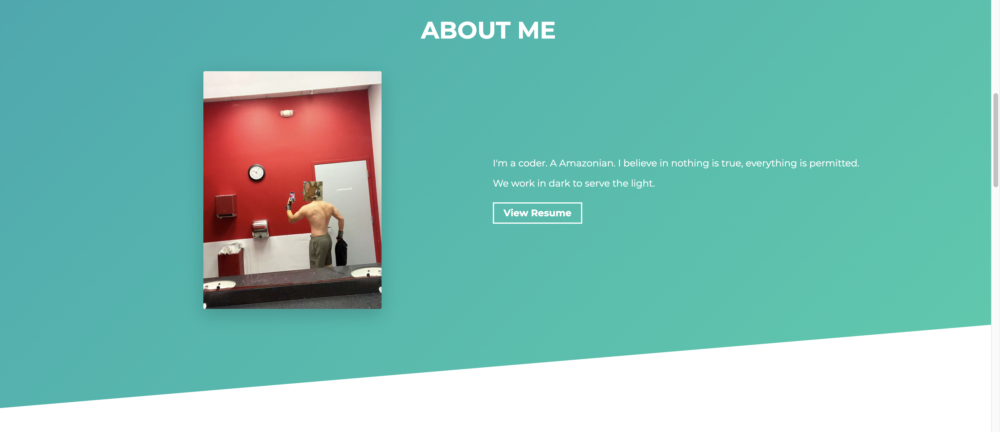
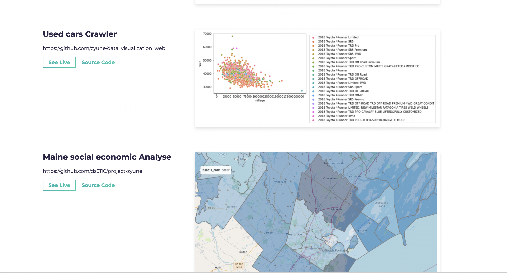

# Simplefolio ⚡️ [](https://github.com/cobidev/simplefolio/blob/master/LICENSE.md)  

## A minimal portfolio template for Developers!

<h2 align="center">
  
  <br>
</h2>

## Features

⚡️ Modern UI Design + Reveal Animations\
⚡️ One Page Layout\
⚡️ Styled with Bootstrap v4.3 + Custom SCSS\
⚡️ Fully Responsive\
⚡️ Valid HTML5 & CSS3\
⚡️ Optimized with Parcel\
⚡️ Well organized documentation

---





## Getting Started 🚀

These instructions will get you a copy of the project up and running on your local machine for development and testing purposes. See deployment for notes on how to deploy the project on a live system.

### Prerequisites 📋

You'll need [Git](https://git-scm.com) and [Node.js](https://nodejs.org/en/download/) (which comes with [NPM](http://npmjs.com)) installed on your computer.

```
node@v16.4.2 or higher
npm@7.18.1 or higher
git@2.30.1 or higher
```

Also, you can use [Yarn](https://yarnpkg.com/) instead of NPM ☝️

```
yarn@v1.22.10 or higher
```

---

## How To Use 🔧

From your command line, first clone Simplefolio:

```bash
# Clone the repository
$ git clone https://github.com/zyune/CS5610_Yune.git
# Move into the repository
$ cd CS5610_Yune

# Remove the current origin repository
$ git remote remove origin
```

After that, you can install the dependencies either using NPM or Yarn.
And please use node version 16

```
$ nvm use 16
```

Using NPM: Simply run the below commands.

```bash
# Install dependencies
$ npm install

# Start the development server
$ npm start
```

Using Yarn: Be aware of that you'll need to delete the `package-lock.json` file before executing the below commands.

```bash
# Install dependencies
$ yarn

# Start the development server
$ yarn start
```

**NOTE**:
If your run into issues installing the dependencies with NPM, use this below command:

```bash
# Install dependencies with all permissions
$ sudo npm install --unsafe-perm=true --allow-root
```

Once your server has started, go to this url `http://localhost:1234/` to see the portfolio locally. It should look like the below screenshot.

<h2 align="center">
  
</h2>

---
