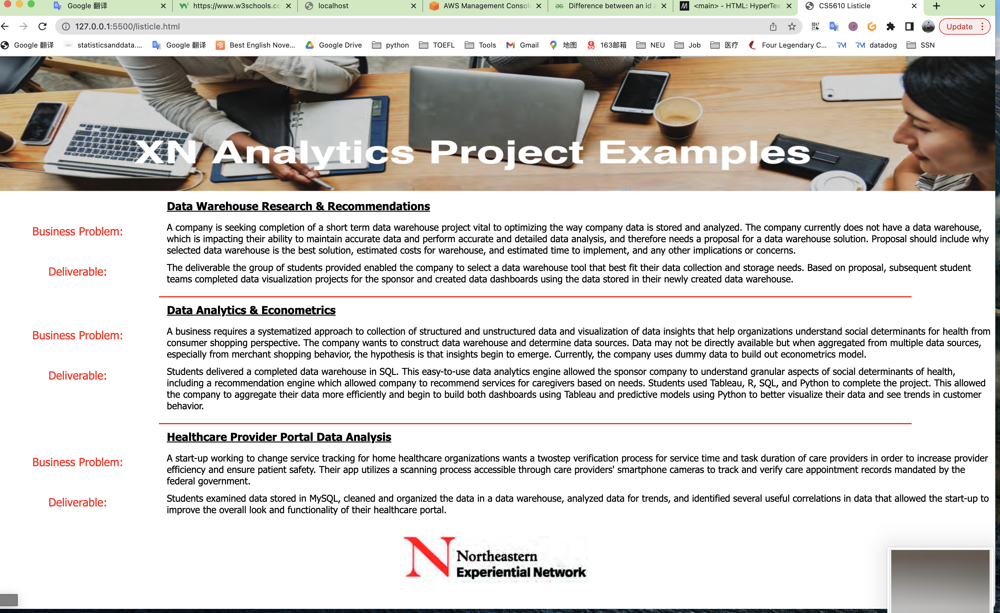

# cs5610_yune-hw2

I use vscode to do this homework.

# This is the live server extension, I use for quick view my page

ALso I set up a github page for this homework please go to [link](https://zyune.github.io/cs5610_yune-hw2/)
