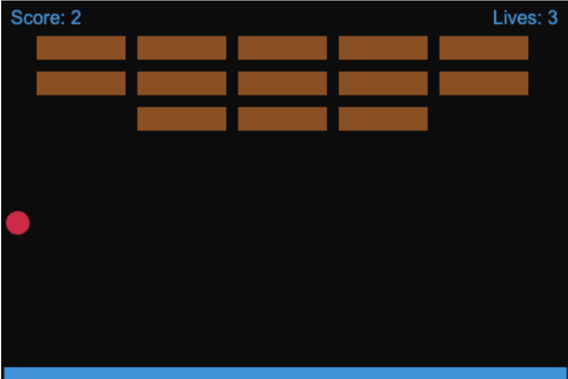
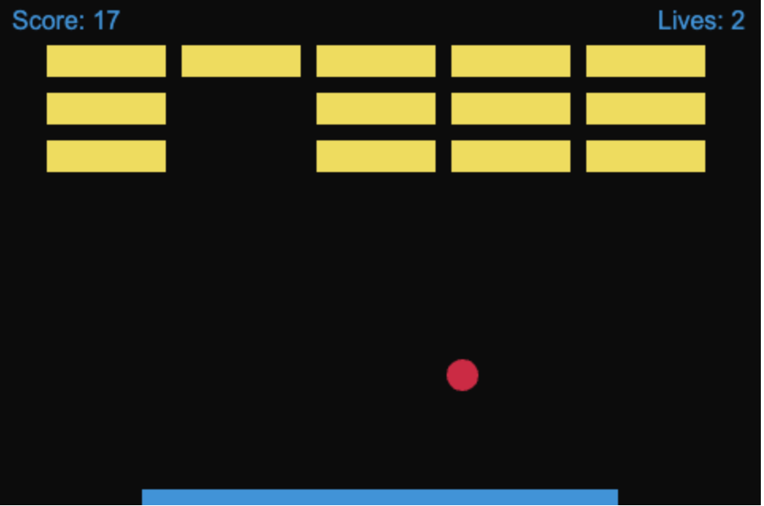
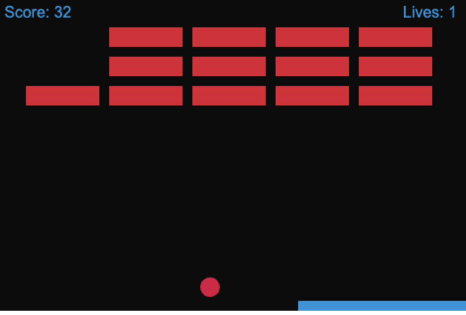
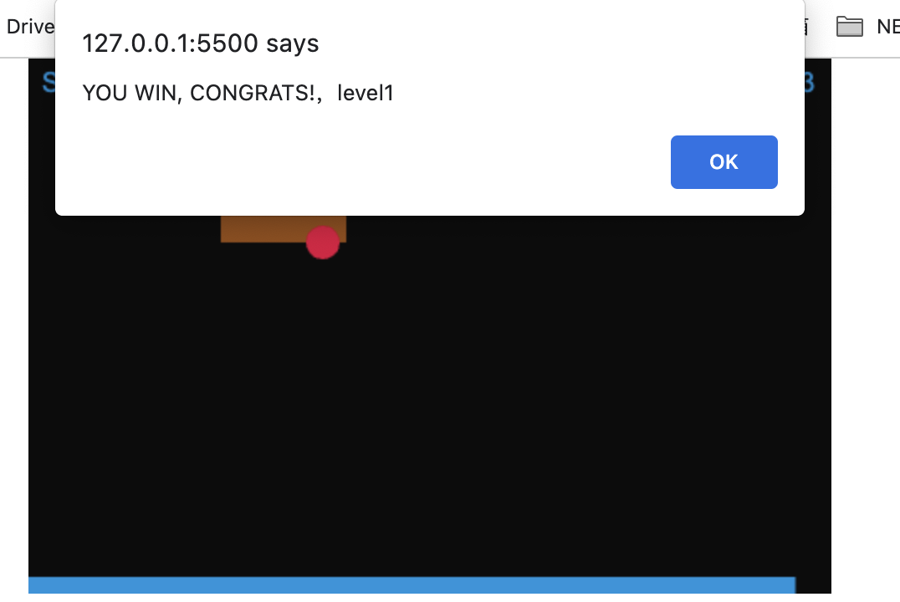
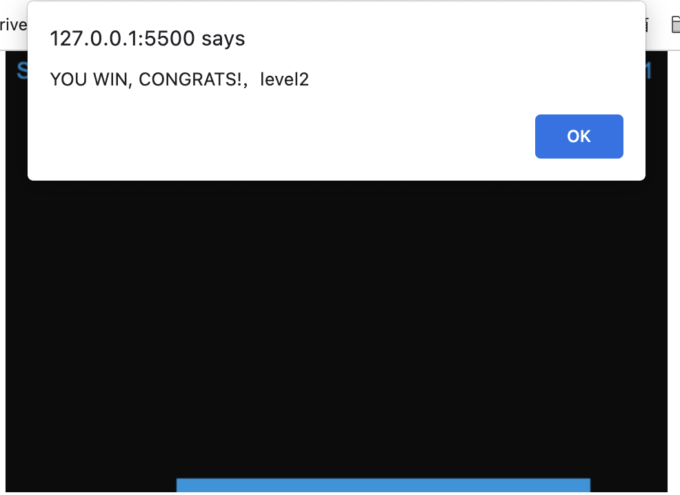
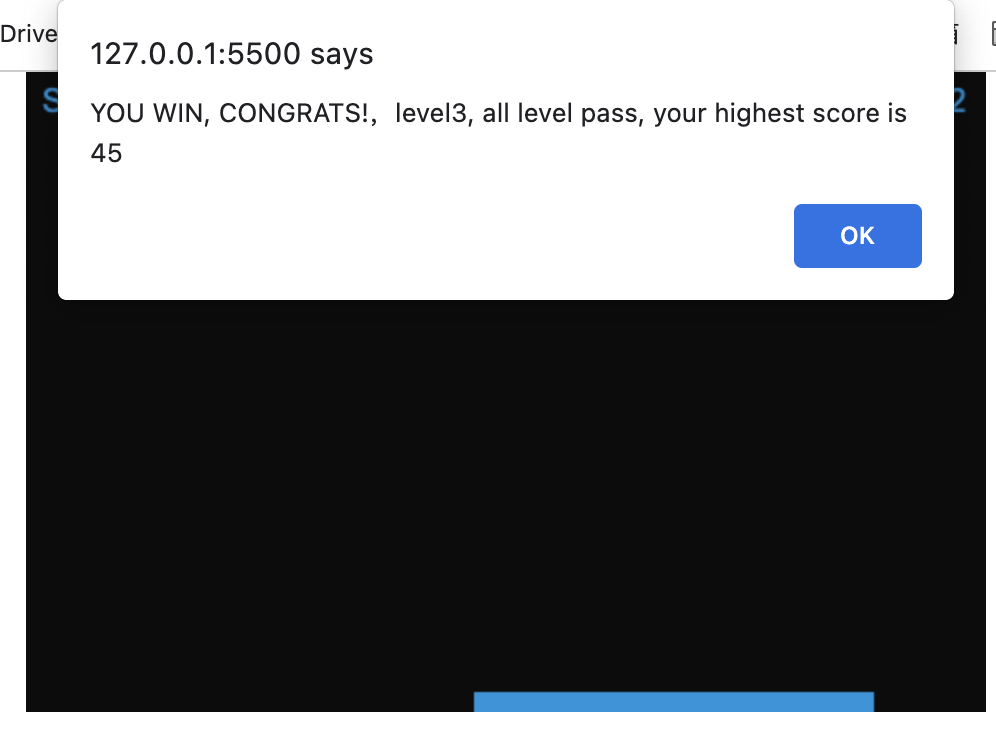
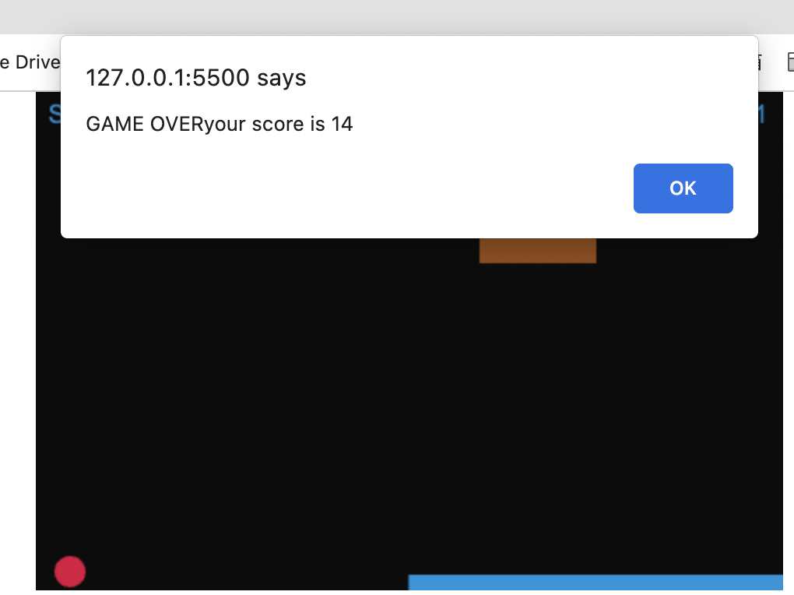

There are three level of game
WHat I did for this Project

# Randomize the colors of the bricks





# rack levels and refresh the board when a level is completed

```
    function addLevel(){
        level=level+1
    }
```





# Adjust the speed of the ball, As the levels increase, the speed of the ball increases

# Record a high score (only in the running game, not a perpetually stored version



# Adjust the length of the paddle

In draw function

```

        if (level==2){

            paddleWidth=300
        }
        if (level==3){
            paddleWidth=200
        }
```
